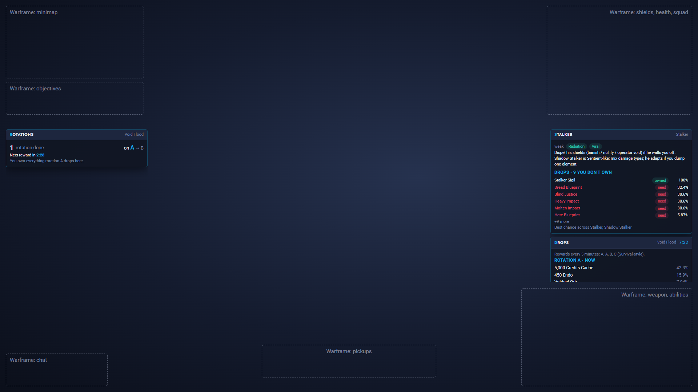
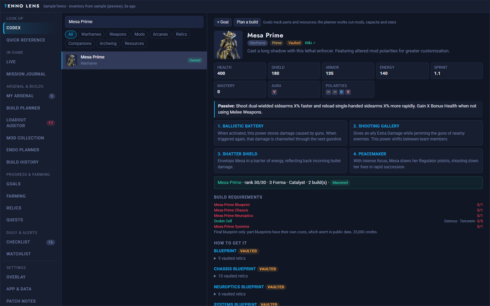
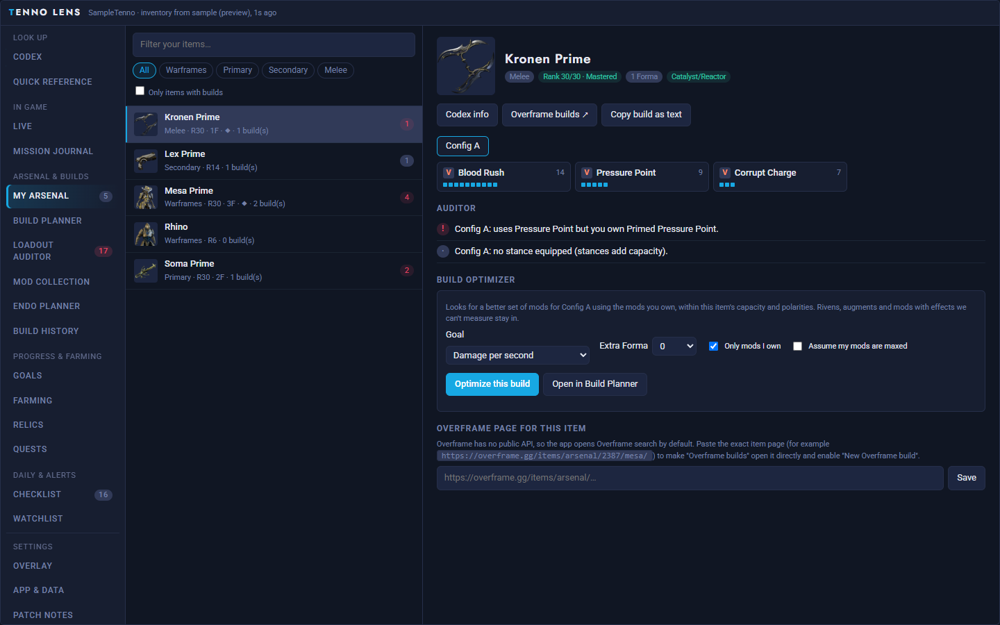
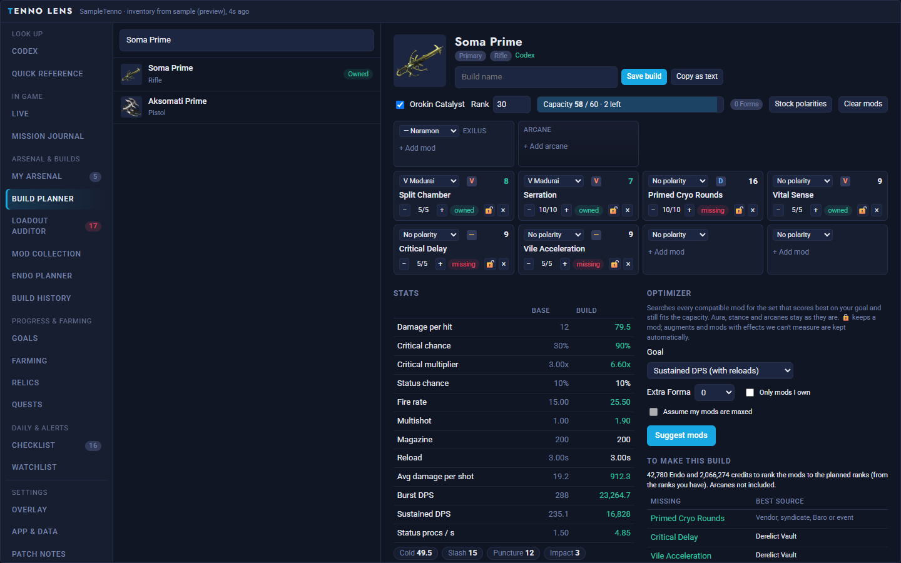
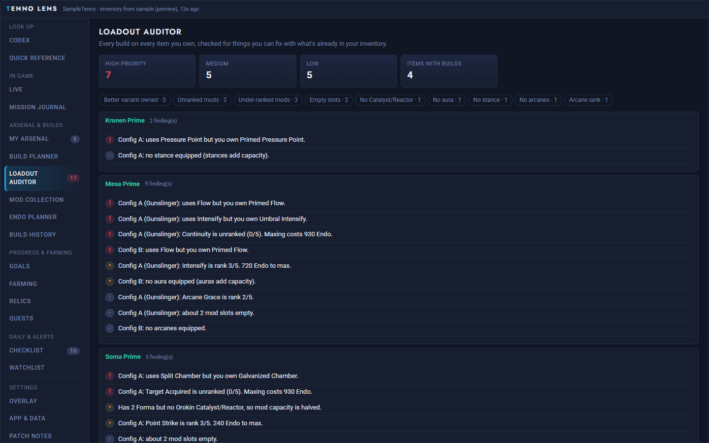
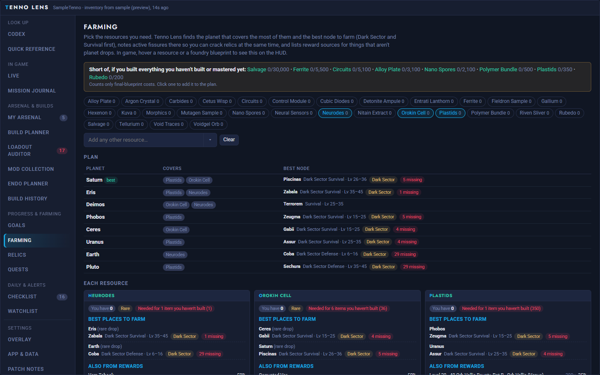
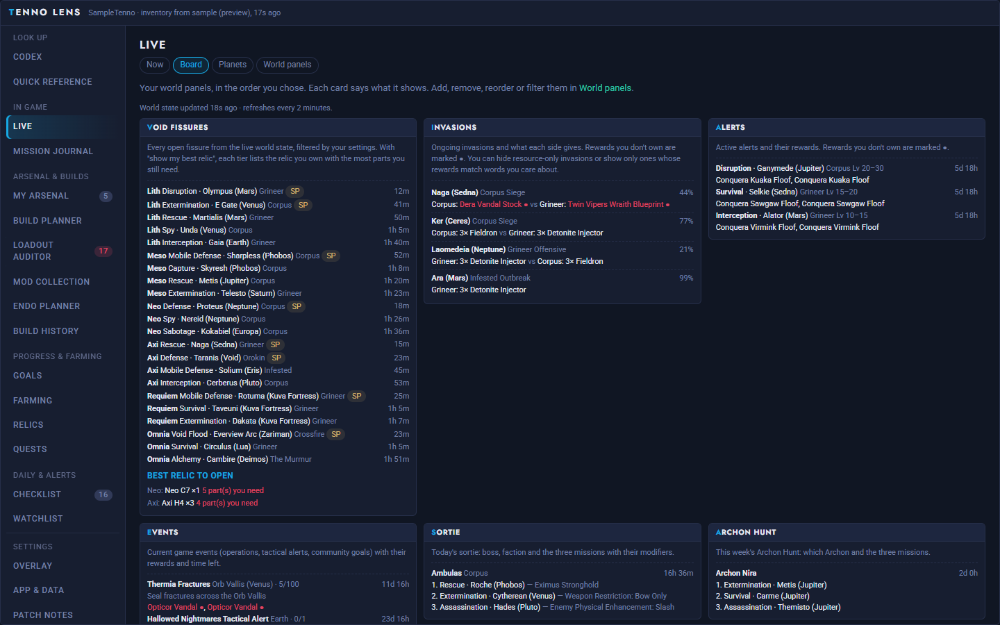
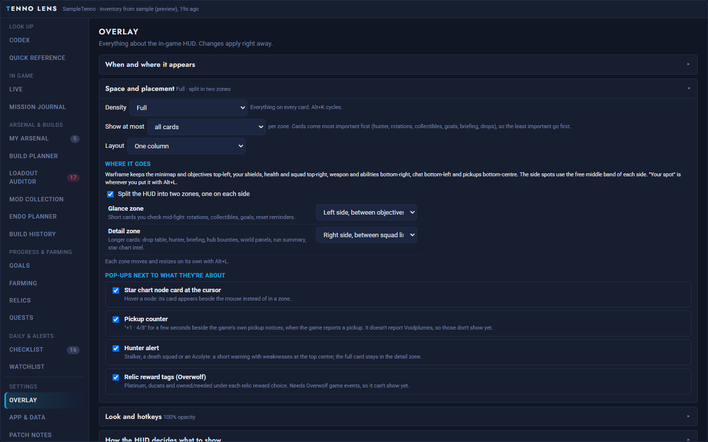
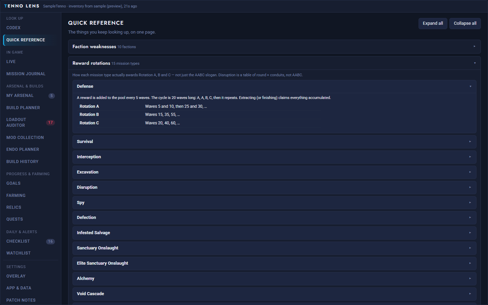

# Tenno Lens

A Warframe companion app for Windows. Look up any item, mod or relic; plan and optimize builds; find what's wrong with your loadouts; plan farming runs; and get an in-game HUD that follows what you're doing: the node you're hovering on the star chart, the mission you're in, the hub you're standing in, and how your run went.

**[⬇ Download the latest version](https://github.com/ostevennugent/tenno-lens-releases/releases/latest)**: on that page, under **Assets**, click `TennoLens-Setup-<version>.exe`.

*The in-game HUD in a mission, on a stand-in screen. The dashed boxes mark where Warframe's own HUD sits; Tenno Lens keeps to the free space between them.*

This repository hosts the release builds and is the update feed the app checks. Screenshots use a made-up sample inventory.

## What it does

### In game

- **HUD that follows the game.** Tenno Lens reads Warframe's own log as you play, so the HUD knows whether you're on the star chart, in a mission, back in a hub or on your ship, and shows what's useful there.
- **Two zones that stay out of the way.** A *glance zone* on the left (rotations, collectibles, goals, reset reminders) and a *detail zone* on the right (drop table, hunter card, briefing, hub bounties, world panels, run summary). Each sits in a free band: below the minimap and objectives, below the squad list and above your abilities. Move or resize either one with `Alt+L`, or put everything in one window.
- **Star chart.** Hover a node to see its mission type, enemy level, faction weaknesses, active fissures, sorties or invasions there, and the rewards you don't own yet. The node card follows your cursor. For a fissure node, your relics of that tier are ranked by parts you still need.
- **Missions.** The drop table with what you're missing, the rotation rules for the mode, and a rotation tracker for endless missions (rotations done, which one you're on, time to the next reward in Survival and Void Flood, relics opened in fissures). If one of your goals drops there, the HUD says which part and at which rotation.
- **Hunters and bosses.** When Stalker, a death squad, an Acolyte or your Lich, Sister or Coda turns up, you get a short alert with their weaknesses and a card with how to fight them and what they drop (with drop chances, and which drops you're missing).
- **Hubs.** In Cetus, Fortuna, the Necralisk, Sanctum Anatomica and Chrysalith: the local day/night, warm/cold, Fass/Vome or Zariman cycle, and the bounties on offer with the rewards you don't own.
- **Run summary.** Time, credits, Eximus, rotations and relics opened, plus your session's success rate, credits per hour and runs per hour.
- **Reset reminders.** Unfinished checklist tasks (sortie, dailies, weeklies, Baro) with the time left before they reset.
- **Make it yours.** Density (full, compact, or one line per card), opacity, a card limit, which cards show, and presets that change them automatically in hubs, fissures, endless missions and missions launched from a hub.

### On your PC

| | |
|---|---|
|  |  |
| **Codex.** Every item, mod, arcane, relic and resource, with stats, abilities, build requirements and where each part drops. | **My Arsenal.** Your items with their builds, mastery and Forma, and an optimizer for each build. |
|  |  |
| **Build Planner.** Slot mods with real capacity and polarity rules, see the stats change, and let the optimizer suggest the best mods for damage, survivability or ability stats. It lists what you'd still need and where to get it. | **Loadout Auditor.** Checks every build you own for fixes you can make with what you already have: a better variant you own, unranked mods, empty slots, missing aura, stance or arcanes. |
|  |  |
| **Farming.** Pick the resources you need and it finds the planet that covers the most of them and the best node there, plus other reward sources. | **Live.** Fissures, invasions, alerts, events, sortie, Archon Hunt, cycles, Nightwave, Baro and more, each filterable, with what you don't own marked. |
|  |  |
| **Overlay settings.** Where the HUD goes, how it looks, which cards and pop-ups show, and activity presets. | **Quick Reference.** Faction weaknesses, how each mission type awards rotations, planet resources and relic refinement odds. |

Also: Mod Collection, Endo Planner, Build History, Goals, Relics, Quests (with walkthroughs), a daily and weekly Checklist, a Watchlist that notifies you when something you want shows up (a fissure, invasion or alert reward, Baro item, Arbitration, Darvo deal or event), and a Mission Journal of your runs.

## Install

1. Download `TennoLens-Setup-<version>.exe` from the [latest release](https://github.com/ostevennugent/tenno-lens-releases/releases/latest) and run it.
2. Windows may show **"Windows protected your PC"** because the installer isn't code-signed yet. Click **More info → Run anyway**.
3. Follow the installer. Tenno Lens starts in the system tray; click the tray icon to open it.

On first launch it downloads the game data (about 25 MB) once and caches it.

## In-game HUD setup

Run Warframe in **Borderless Windowed** (Options → Display → Display Mode) so the HUD can appear on top of the game. Everything about the HUD is under **Settings → Overlay** in the app.

| Key | Action |
|---|---|
| `Alt+Q` | Quick search |
| `Alt+W` | Show / hide the HUD |
| `Alt+E` | Open the main window |
| `Alt+L` | Move / resize the HUD zones |
| `Alt+K` | Cycle density: full, compact, glance |
| `Alt+O` | Cycle opacity |

## Updates

Tenno Lens updates itself. It checks this page when it starts and every few hours, downloads new versions in the background (usually just a few MB), and asks **Restart and update** or **Later**. Later installs the update the next time you quit the app. You can check your version and look for updates in **Settings → App & Data**, or from the tray menu. What changed in each version is under **Settings → Patch notes** and on the [releases page](https://github.com/ostevennugent/tenno-lens-releases/releases).

## What it can and can't see

Tenno Lens works from Warframe's log file (`EE.log`) and public game data, so it only knows what the game writes down:

- It knows which node you hover, which mission you load, when a mission or rotation ends, the credits you earned, which hub you're in and when hunters appear.
- **Collectibles:** Warframe doesn't log Voidplume pickups (yours or your squad's), so it can't count them yet. The same likely applies to Voca and Hex treasures.
- **Your full inventory with mods** comes from Overwolf game events, which aren't available yet. Until then you can import an inventory JSON, or load your mastery and equipped gear from your public Warframe profile, in **Settings → App & Data**.

## Privacy

Tenno Lens reads Warframe's log file (`EE.log`) on your PC to know where you are in the game. It doesn't read or change game memory or other apps' files, and doesn't send your data anywhere. Game data comes from public sources (WFCD, warframestat.us).

---
Tenno Lens is a fan project and isn't affiliated with Digital Extremes. Warframe is a trademark of Digital Extremes Ltd.
